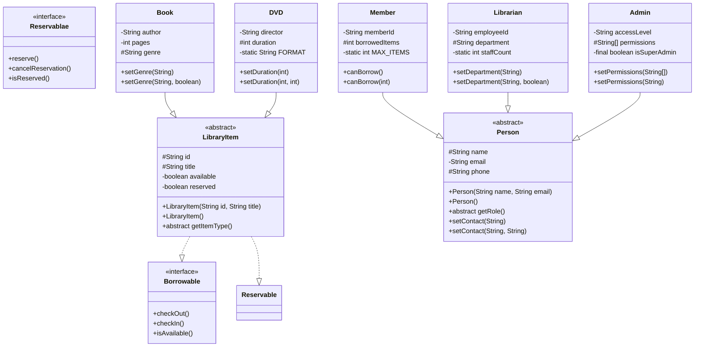

```mermaid
classDiagram
    %% Interfaces
    class Borrowable {
        <<interface>>
        +checkOut()
        +checkIn()
        +isAvailable()
    }
    
    class Reservablae {
        <<interface>>
        +reserve()
        +cancelReservation()
        +isReserved()
    }

    %% Abstract Classes
    class LibraryItem {
        <<abstract>>
        #String id
        #String title
        -boolean available
        -boolean reserved
        +LibraryItem(String id, String title)
        +LibraryItem()
        +abstract getItemType()
    }

    class Person {
        <<abstract>>
        #String name
        -String email
        #String phone
        +Person(String name, String email)
        +Person()
        +abstract getRole()
        +setContact(String)
        +setContact(String, String)
    }

    %% Concrete Classes
    class Book {
        -String author
        -int pages
        #String genre
        +setGenre(String)
        +setGenre(String, boolean)
    }

    class DVD {
        -String director
        #int duration
        -static String FORMAT
        +setDuration(int)
        +setDuration(int, int)
    }

    class Member {
        -String memberId
        #int borrowedItems
        -static int MAX_ITEMS
        +canBorrow()
        +canBorrow(int)
    }

    class Librarian {
        -String employeeId
        #String department
        -static int staffCount
        +setDepartment(String)
        +setDepartment(String, boolean)
    }

    class Admin {
        -String accessLevel
        #String[] permissions
        -final boolean isSuperAdmin
        +setPermissions(String[])
        +setPermissions(String)
    }

    %% Relationships
    LibraryItem ..|> Borrowable
    LibraryItem ..|> Reservable
    Book --|> LibraryItem
    DVD --|> LibraryItem
    Member --|> Person
    Librarian --|> Person
    Admin --|> Person
```
